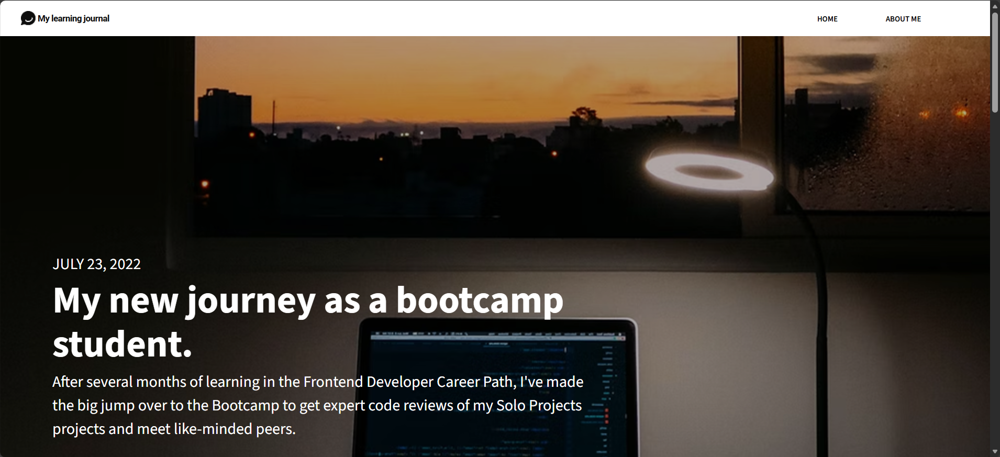
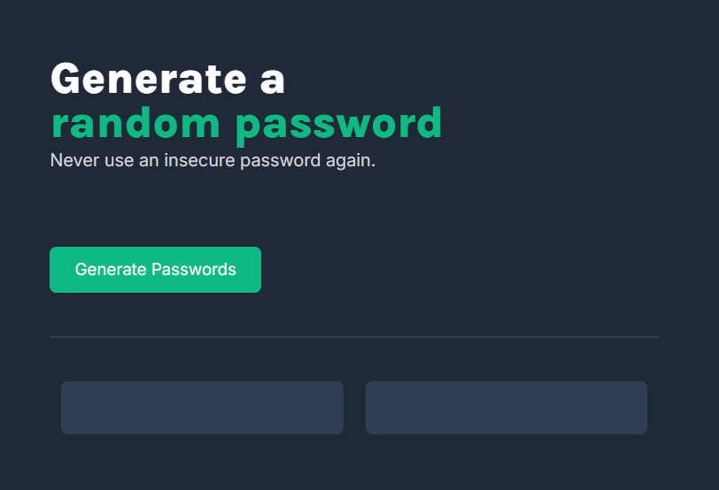
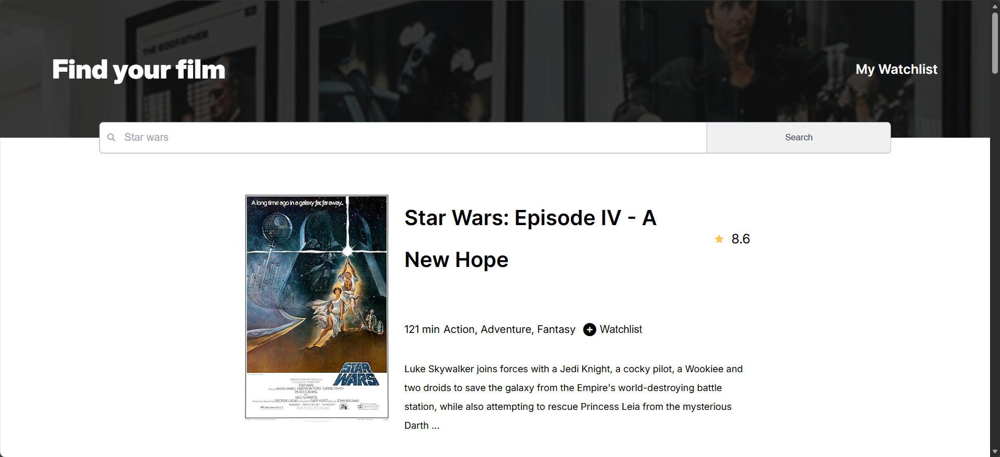

# Scrimba Projects Portfolio (In Progress)

Welcome to my collection of projects from the [Scrimba](https://scrimba.com) Fullstack development path course! This repository showcases my journey learning web development through hands-on projects.

## About Me

A student from the Philippines! Taking a certificate program in Associates in Computing Technology at De La Salle Lipa.

### Why did I start Scrimba?
I was looking for resources to help me build my portfolio and interests in web development, and Scrimba has helped me reach my foundational goals in learning full-stack development.

### What did I learn so far?
- HTML, CSS & JavaScript fundamentals
- Understanding Accessibility in Websites
- Essential JS (Error Handling & Asynchronous Programming)
- Responsive Design (Mobile first design)
- Version control with Git and GitHub

### Goals and Modules I am currently working on

There are still quite a few more modules to work on in the Scrimba course, listed are:
- AI Engineering
- Node.js, Express.js, and React.js environments
- Databases
- Typescript
- UI Design

Future goals:
- Have a presentable portfolio (website)
- Work in tech companies that focus on web development (or any tech stack within my skill set)

---

## Featured Projects

### Learning Journal(learning_journal)


A foundation of my learning journey in Scrimba. Although when working on this solo project, the contents of the website are only what was shown from the instructions of the Scrimba project

**Tech Stack:** HTML, CSS, JavaScript

[View Code](learning_journal)

---

### Password Generator(password_generator)


A password generator. Generate two random 15-character passwords

**Tech Stack:** HTML, CSS, JavaScript

[View Code](password_generator)

---

### Movie Watchlist(movie_watchlist)


**Description:** A movie watchlist. You can search for movies and TV series and add them to your watch list.
Data from The Open Movie Database API (opendbapi.com)

**Tech Stack:** HTML, CSS, JavaScript, API Integration

[View Code](movie_watchlist)

---

## All Projects

| # | Project Name | Description | Tech Stack |
|---|--------------|-------------|------------|
| 1 | [Score Board](scoreboard) | Basketball Scoreboard | HTML, CSS, JS |
| 2 | [Password Generator](password_generator) | Password Generator | HTML, CSS, JS |
| 3 | [Unit Converter](unit_converter) | Convert Units (metric and imperial) | HTML, CSS, JS |
| 4 | [Leads Extension](leads_extension) | Browser extension to keep track of leads | HTML, CSS, JS, JSON, WebExtension |
| 5 | [Restaurant Ordering App](restaurant_ordering_app) | Jimmy's Diner Order Simple App | HTML, CSS, JS |
| 6 | [Instagram Clone](instagram_clone) | Instagram Clone | HTML, CSS, JS |
| 7 | [Learning Journal](learning_journal) | A responsive learning journal website | HTML, CSS |
| 8 | [Color Scheme Generator](color_scheme_generator) | Color Scheme Generator | HTML, CSS, JS |
| 9 | [Movie Wathclist](movie_watchlist) | Save your movies in your watchlist | HTML, CSS, JS, API Integration |

## Technologies Used


## Getting Started

To run any project locally:

1. Clone this repository
```bash
git clone https://github.com/yourusername/scrimba-projects.git
```

2. Navigate to the project folder
```bash
cd scrimba-projects/project-name
```

3. Open `index.html` in your browser or use a local server
```bash
# Using Python
python -m http.server 8000

# Using Node.js
npx serve
```

## 🎓 Certification

Getting there...

