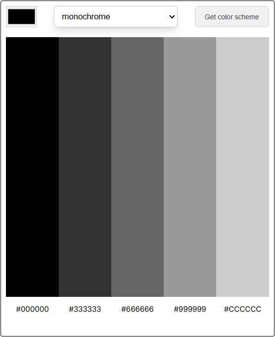

# Color Scheme Generator

A simple and interactive color scheme generator that uses **The Color API** to create harmonious color palettes based on a selected base color and scheme type. Built with vanilla HTML, CSS, and JavaScript.



## Features

* **Color Picker Input:** Choose any base color using the native HTML color input
* **Multiple Color Schemes:** Supports monochrome, analogic, complement, triad, quad, and more
* **Real-Time API Fetching:** Generates color palettes dynamically using The Color API
* **Five-Color Palette Display:** Displays five colors per generated scheme
* **Hex Code Labels:** Each color shows its corresponding HEX value
* **Default Color Load:** Preloaded neutral color palette on initial page load
* **Clean UI Layout:** Simple, centered design for focused interaction
* **Responsive-Friendly Structure:** Layout adapts well to different screen sizes

## Technologies Used

* **HTML5**

  * Semantic structure
  * Form handling
  * Native color input
* **CSS3**

  * Flexbox for layout alignment
  * CSS Grid for color palette display
  * Custom styling for form controls
* **JavaScript (Vanilla JS)**

  * DOM manipulation
  * Event handling
  * Fetch API for external data
* **The Color API**

  * External API for generating color schemes
* **Google Fonts**

  * Inter font family

## Supported Color Schemes

The generator supports the following scheme modes from The Color API:

* Monochrome
* Monochrome Dark
* Monochrome Light
* Analogic
* Complement
* Analogic Complement
* Triad
* Quad

## What I Learned

* **Working with External APIs**

  * Constructing dynamic API URLs
  * Fetching and parsing JSON data
  * Handling asynchronous operations with `fetch()`
* **DOM Selection & Manipulation**

  * Using `querySelectorAll()` for grouped elements
  * Updating styles dynamically with JavaScript
  * Rendering API data directly into the UI
* **Form Handling**

  * Preventing default form submission behavior
  * Extracting input values from form elements
* **JavaScript Arrays & Iteration**

  * Using `forEach()` to update multiple DOM elements
  * Mapping API data to visual components
* **UI State Initialization**

  * Setting default colors on initial load
  * Keeping UI predictable before user interaction
* **CSS Grid Layout**

  * Creating a structured 5-column color grid
  * Aligning color blocks with their hex labels

## Design Highlights

**Layout:**

* Centered container with fixed width for consistent appearance
* Clean form layout with aligned inputs and button
* Grid-based color display with equal-width columns

**Typography:**

* **Font Family:** Inter
* Clean, readable sizing for hex codes and UI elements

**Color Display:**

* Large vertical color swatches for clear visual comparison
* Hex values displayed directly below each color

## Key Implementation Details

### Default Colors on Load

```js
const defaultColors = ['#000000', '#333333', '#666666', '#999999', '#CCCCCC']
```

### Fetching Color Schemes from the API

```js
fetch(`https://www.thecolorapi.com/scheme?hex=${hexId.value.slice(1)}&mode=${scheme.value}`)
    .then(res => res.json())
    .then(data => {
        data.colors.forEach((color, i) => {
            colorObj[i].style.background = color.hex.value
            hexObj[i].innerHTML = color.hex.value
        })
    })
```

### CSS Grid for Color Display

```css
.color-grid {
    display: grid;
    grid-template-columns: repeat(5, 1fr);
    grid-template-areas:
        "a1 a2 a3 a4 a5"
        "h1 h2 h3 h4 h5";
}
```

## Running the Project

1. Clone or download the repository
2. Ensure all files are in the same directory
3. Open `index.html` in your browser
4. Select a color and scheme type
5. Click **Get color scheme** to generate a palette

No build tools or dependencies required.

## API Reference

* **The Color API**

  * Endpoint used: `/scheme`
  * Returns color harmony data based on base color and mode
  * Documentation: [https://www.thecolorapi.com](https://www.thecolorapi.com)

## Future Enhancements

* Click-to-copy hex codes
* Display RGB and HSL values
* Save favorite color schemes
* Add loading and error states
* Improve mobile responsiveness
* Add dark mode toggle
* Animate palette transitions
* Allow adjustable number of colors
