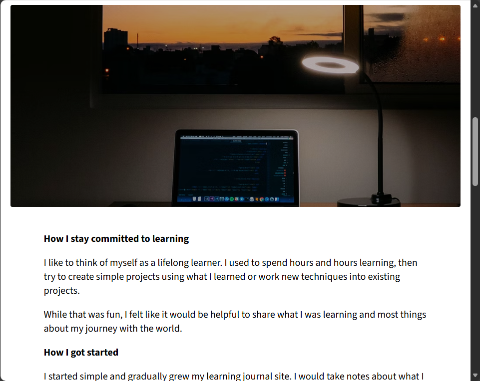
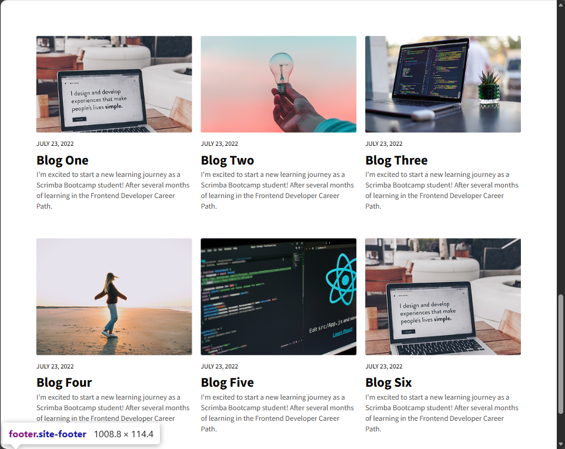

# My Learning Journal - Responsive Blog Website

A fully responsive personal blog/learning journal website showcasing modern CSS layout techniques including CSS Grid and Flexbox. Features mobile-first design with tablet and desktop breakpoints.





## Features

- **Fully Responsive Design:** Adapts seamlessly across mobile, tablet, and desktop
- **Mobile-First Approach:** Built with mobile users as the priority
- **Hero Section:** Full-viewport hero image with overlay text
- **About Me Section:** Personal introduction with avatar and detailed bio
- **Blog Grid Layout:** Responsive article grid (1, 2, or 3 columns based on screen size)
- **Navigation Menu:** Clean, accessible navigation
- **Article Cards:** Six blog post previews with images and excerpts
- **Semantic HTML:** Proper use of semantic tags for accessibility
- **Google Fonts:** Custom typography with Roboto and Source Sans 3
- **Footer:** Dark-themed footer with copyright information

## Technologies Used

- **HTML5** - Semantic markup and accessibility
- **CSS3** - Advanced layout and responsive design
  - CSS Grid (for overall page layout and article grid)
  - Flexbox (for header, navigation, and card layouts)
  - Media queries (tablet: 610px+, desktop: 769px+)
  - Mobile-first approach
- **Google Fonts** - Roboto and Source Sans 3 font families

## Responsive Breakpoints

**Mobile (Default - up to 609px):**
- Single column article layout
- Stacked navigation
- Compact hero section (43vh)
- Centered content

**Tablet (610px - 768px):**
- 2-column article grid
- Full viewport hero (100vh)
- Larger typography
- Side-by-side about section with avatar

**Desktop (769px+):**
- 3-column article grid
- Enhanced spacing and sizing
- Optimized readability
- Maximum content width

## What I Learned

- **CSS Grid Mastery:**
  - Creating complex page layouts with grid-template-areas
  - Responsive grid column changes
  - Grid spanning for full-width sections
- **Flexbox Layouts:**
  - Navigation bars with space-between
  - Flexible header components
  - Card layouts within grid items
- **Mobile-First Design:**
  - Starting with mobile styles as base
  - Progressive enhancement for larger screens
  - Using min-width media queries
- **Responsive Typography:**
  - Fluid font sizing across breakpoints
  - Line-height adjustments for readability
  - Letter-spacing for design polish
- **Background Images:**
  - Using background-size: cover
  - Different images for different breakpoints
  - Proper positioning and no-repeat
- **Box Model Control:**
  - Universal box-sizing reset
  - Padding and margin management
  - Width constraints for content
- **Semantic HTML:**
  - Using proper header, main, section, article, footer tags
  - Accessibility considerations
  - Meaningful class names

## Design Highlights

**Color Palette:**
- Primary Text: #0E0E0E (near black)
- Secondary Text: #505050 (gray)
- Footer Background: #202020 (dark gray)
- Footer Text: #ECECEC (light gray)
- Background: White

**Typography:**
- **Headings:** Roboto (bold, 700 weight)
- **Body Text:** Source Sans 3 (400-600 weight)
- **Responsive Sizing:** Grows from mobile to desktop

**Layout Structure:**
- Fixed side margins (1em gutters)
- Centered content containers
- Full-width hero and footer
- Flexible article grid

## CSS Grid Implementation

**Page Layout:**
```css
body {
    display: grid;
    grid-template-columns: 1em 1fr 1em;
    grid-template-areas:
        "... head ..."
        "... hero ..."
        "... cont ..."
        "... foot ...";
}
```

**Article Grid (Desktop):**
```css
.articles {
    display: grid;
    grid-template-columns: 1fr 1fr 1fr;
    gap: 1em;
    grid-template-areas:
        "a1 a2 a3"
        "a4 a5 a6";
}
```

## Running the Project

1. Clone or download the project files
2. Ensure proper folder structure with `/css` and `/images` directories
3. Open `index.html` in your web browser
4. Resize browser to see responsive behavior

No dependencies or build tools required!

## Testing Responsive Design

**In Chrome DevTools:**
1. Right-click page → Inspect
2. Click device toolbar icon (Ctrl+Shift+M)
3. Test different device sizes:
   - iPhone SE (375px)
   - iPad (768px)
   - Desktop (1024px+)

## Key CSS Techniques

**Universal Box Model Reset:**
```css
*, *::before, *::after {
    box-sizing: border-box;
}
```

**Mobile-First Media Queries:**
```css
/* Base styles for mobile */
.articles { grid-template-columns: 1fr; }

/* Tablet enhancement */
@media (min-width: 610px) {
    .articles { grid-template-columns: 1fr 1fr; }
}

/* Desktop enhancement */
@media (min-width: 769px) {
    .articles { grid-template-columns: 1fr 1fr 1fr; }
}
```

**Hero Section Responsiveness:**
```css
/* Mobile: 43vh height */
.hero-section { height: 43vh; }

/* Tablet+: Full viewport */
@media (min-width: 610px) {
    .hero-section { height: 100vh; }
}
```

## Accessibility Features

- Semantic HTML5 elements (header, nav, main, article, footer)
- Alt text ready for images (placeholder in HTML)
- Proper heading hierarchy (h1, h2, h3)
- High contrast text colors for readability
- Descriptive link text
- Mobile-friendly touch targets

## Future Enhancements

- Add JavaScript for "View More" functionality
- Implement actual blog post pages
- Add search functionality
- Create tag/category filtering
- Add dark mode toggle
- Implement pagination for articles
- Add reading time estimates
- Create RSS feed
- Add social sharing buttons
- Add smooth scroll behavior
- Create "Back to top" button

## Content Structure

**Hero Section:** Featured/latest article with full-width image
**About Me:** Personal introduction and bio
**Recent Articles:** Grid of 6 blog post previews
**Footer:** Site info and copyright

## Learning Outcomes

This project demonstrates proficiency in:
- Modern CSS layout systems (Grid + Flexbox)
- Responsive web design principles
- Mobile-first development approach
- Typography and visual hierarchy
- Semantic HTML and accessibility
- Image optimization and backgrounds
- Clean, maintainable CSS architecture
