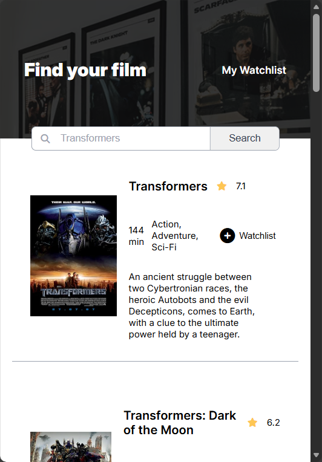
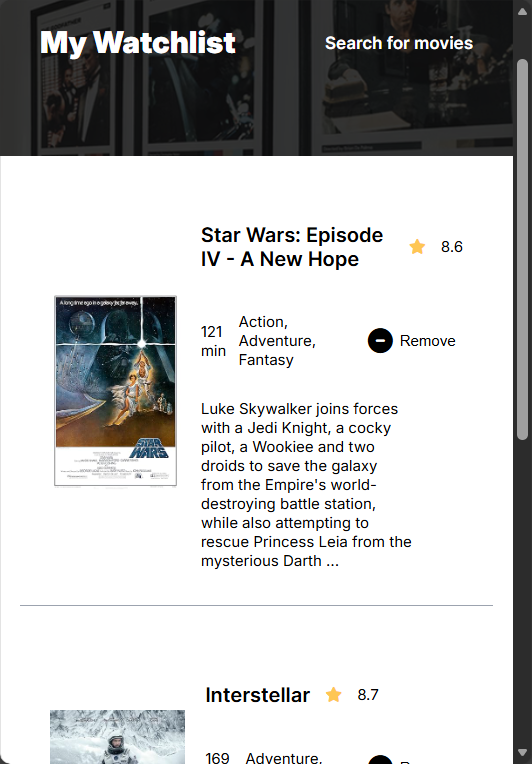

# Movie Watchlist

A movie search application that lets you find films using the OMDB API and save your favorites to a personal watchlist.

  
  

## Features

- **Movie Search:** Search for any movie using the OMDB API and get detailed results
- **Movie Details:** View poster, title, IMDb rating, runtime, genre, and plot for each film
- **Watchlist Management:** Add movies to your personal watchlist with one click
- **Persistent Storage:** Your watchlist is saved locally and persists between sessions
- **Remove Movies:** Easily remove films from your watchlist when you're done with them

## Technologies Used

- **HTML5** – Semantic structure and layout
- **CSS3** – Custom styling with Flexbox for responsive design
- **JavaScript (ES6)** – Async/await, Fetch API, and DOM manipulation
- **OMDB API** – External movie database for fetching film information
- **localStorage** – Client-side storage for watchlist persistence
- **Font Awesome** – Icons for search, stars, and action buttons
- **Google Fonts** – Inter font family for clean typography

## How to Use

1. Enter a movie title in the search bar on the main page
2. Click "Search" to fetch matching movies from the OMDB database
3. Browse through the results showing poster, rating, runtime, genre, and plot
4. Click the "Watchlist" button to save a movie to your personal list
5. Navigate to "My Watchlist" to view all your saved movies
6. Click "Remove" to delete a movie from your watchlist

## What I Learned

- **Working with APIs:** Fetching data from external APIs using async/await and handling responses
- **Promise.all():** Making multiple API calls simultaneously for better performance
- **localStorage:** Persisting data in the browser for a seamless user experience
- **Event Delegation:** Handling click events on dynamically generated elements
- **ES6 Template Literals:** Building dynamic HTML strings with embedded expressions
- **Error Handling:** Using try/catch blocks to gracefully handle API errors
- **Responsive Design:** Creating layouts that work across different screen sizes

##  Running the Project

1. Clone or download the project files
2. Ensure all required files are in the same directory:
   - `index.html`
   - `watchlist.html`
   - `index.css`
   - `index.js`
   - `watchlist.js`
   - `images/` folder (header background and placeholder images)
3. Open `index.html` in your browser

No build tools or dependencies required — just open and run!

## Design Highlights

- **Color Palette:** Dark theme header (#0E0E0E) with clean white content area
- **Typography:** Inter font family for modern, readable text
- **Layout:** Flexbox-based responsive design with centered content
- **UI Elements:** 
  - Floating search bar positioned over the header
  - Movie cards with poster thumbnails and detailed information
  - Star icons for IMDb ratings
  - Hover effects on buttons and links

## Future Enhancements

- Add movie trailers using YouTube API integration
- Implement movie categories and filtering options
- Add user ratings and personal notes for watchlist items
- Create a "watched" status to track completed movies
- Add sorting options (by rating, title, year)
- Implement dark/light theme toggle
