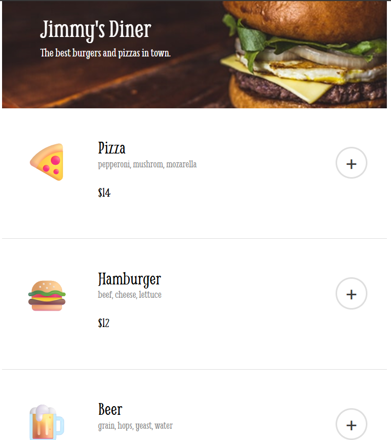
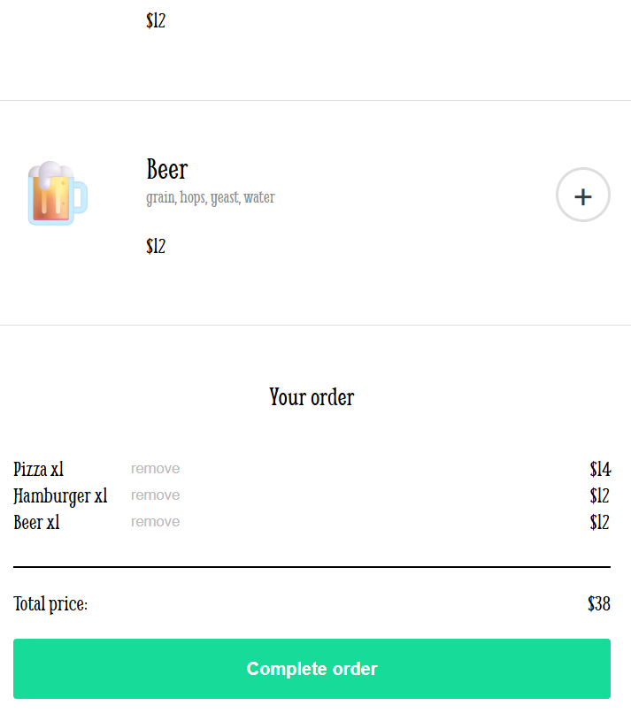

# Jimmy's Diner - Restaurant Ordering App

A fully functional restaurant ordering application with a shopping cart, checkout modal, and form validation. Built with vanilla JavaScript and ES6 modules.

<div style="display: flex">
  
  
</div>

## Features

- **Interactive Menu:** Browse food items with prices and ingredients
- **Shopping Cart:** Add multiple items with quantity tracking
- **Remove Items:** Delete individual items from cart
- **Live Total Calculation:** Real-time price updates as cart changes
- **Payment Modal:** Pop-up checkout form with card details
- **Form Validation:** 
  - Name: Letters and spaces only
  - Card Number: Auto-formatted as ####-####-####-#### (16 digits)
  - CVV: 3-digit validation
  - Real-time input validation with disabled/enabled pay button
- **Order Confirmation:** Personalized thank you message after payment
- **Smart UI Controls:** Complete order button disabled while modal is open
- **Modal Click-Outside-to-Close:** Click modal background to close (but not form)
- **Quantity Display:** Shows "x2" or "x3" for multiple same items

## Technologies Used

- **HTML5** - Semantic structure
- **CSS3** - Custom styling with Google Fonts
- **JavaScript (ES6+)** - Core functionality
  - ES6 Modules (`import/export`)
  - Event delegation
  - Array methods (`map`, `forEach`, `find`, `splice`)
  - Object manipulation
  - Template literals
  - Regular expressions for validation
- **Google Fonts** - Smythe and Inter font families

## How to Use

1. **Browse Menu:** View available food items with prices
2. **Add to Cart:** Click the "+" button to add items to your order
3. **Manage Cart:** 
   - Add multiple quantities of the same item
   - Click "remove" to delete items
   - View real-time total
4. **Checkout:** Click "Complete order" button
5. **Enter Payment:** Fill out the modal form with:
   - Full name
   - Card number (auto-formats with dashes)
   - CVV (3 digits)
6. **Submit:** Pay button enables when all fields are valid
7. **Confirmation:** See personalized thank you message

## What I Learned

- **Advanced Form Validation:** Real-time input formatting and validation
- **Regular Expressions:** Pattern matching for name and card validation
- **Modal Management:** Opening/closing with background click handling
- **Event Propagation:** Using `stopPropagation()` to prevent modal content clicks from closing modal
- **Dynamic Item Counting:** Tracking item quantities in cart
- **State Management:** Managing orders array and UI state
- **Button State Control:** Enabling/disabling buttons based on conditions
- **Complex Data Manipulation:** Finding, counting, and removing items from arrays
- **ES6 Modules:** Separating data from logic
- **Template Literals:** Building complex HTML dynamically
- **UX Design:** Preventing double-submissions and improving user flow

## Technical Implementation

**Card Number Auto-Formatting:**
```javascript
cardInput.addEventListener('input', function(e) {
    let value = this.value.replace(/\D/g, '')  // Remove non-digits
    value = value.substring(0, 16)  // Limit to 16 digits
    let formatted = value.match(/.{1,4}/g)?.join('-') || value
    this.value = formatted
})
```

**Quantity Tracking:**
```javascript
const itemCounts = {}
orders.forEach(item => {
    itemCounts[item] = (itemCounts[item] || 0) + 1
})
// Display: "Pizza x3"
```

**Form Validation Logic:**
```javascript
const nameValid = nameInput.value.trim().length > 0
const cardValid = cardInput.value.replace(/-/g, '').length === 16
const cvvValid = cvvInput.value.length === 3

if (nameValid && cardValid && cvvValid) {
    payBtn.disabled = false  // Enable payment
}
```

## Design Highlights

- **Retro Diner Theme:** Classic diner aesthetic with custom header
- **Color Palette:** White background with mint green accents (#16DB99)
- **Typography:** Smythe font for authentic diner feel
- **Centered Layout:** 600px fixed-width design
- **Card-Based Menu Items:** Clean separation of food items
- **Modal Overlay:** Dark shadow with centered form
- **Hover Effects:** Interactive feedback on buttons
- **Form Styling:** Large, easy-to-use input fields

## Menu Items (Sample Data)

1. **Pizza** - $14 (Pepperoni, mushroom, mozzarella)
2. **Hamburger** - $12 (Beef, cheese, lettuce)
3. **Beer** - $12 (Grain, hops, yeast, water)

## Running the Project

1. Clone or download the project files
2. Ensure proper folder structure with `/images` directory
3. Open `index.html` in your web browser
4. **Note:** Must be served via HTTP server for ES6 modules

**Quick Server Options:**
```bash
# Using Python
python -m http.server 8000

# Using Node.js
npx serve

# Using VS Code
Use Live Server extension
```

## Important Features

- **Real-time Validation:** Form inputs validated as you type
- **Auto-formatting:** Card number automatically adds dashes
- **Input Restrictions:** 
  - Name accepts only letters and spaces
  - Card number limited to 16 digits
  - CVV limited to 3 digits
- **Smart Button States:** Pay button only enabled when form is valid
- **No Duplicate Submissions:** Complete order button disabled during checkout
- **Modal UX:** Click outside form to close, but clicking form keeps it open

## Future Enhancements

- Add more menu items with categories (appetizers, desserts, drinks)
- Implement food customization (add/remove toppings)
- Add delivery vs pickup option
- Include tip calculator
- Save order history to localStorage
- Add user authentication
- Add order tracking status
- Include special instructions field
- Add dietary filters (vegetarian, gluten-free)
- Implement promo code functionality
- Add restaurant hours and contact info
- Create print receipt feature
